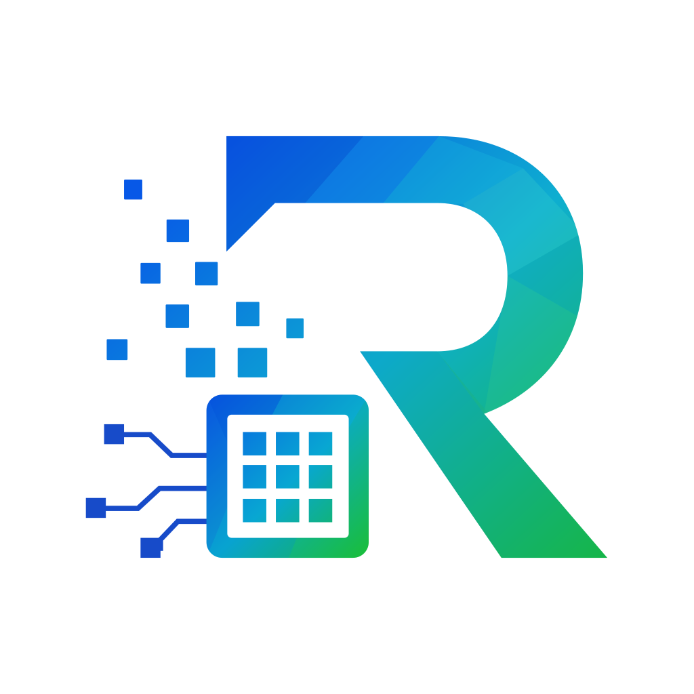

# cudaverse



`cudaverse` provides GPU-aware numerical workflows for R.

The public API is organized by topic:

- device selection and compute provenance;
- dense tensors and sparse matrices;
- SVD, PCA, distances, k-nearest neighbours, and k-means;
- weighted kNN graphs, Louvain, and Leiden clustering;
- UMAP, t-SNE, and diffusion-map-style embeddings.

CUDA is optional. The package includes a lightweight native backend and
can also use a supported CUDA-enabled `torch` installation. NVIDIA
libraries are discovered only when CUDA diagnostics or selection is
requested. When neither CUDA path is available, functions use their
documented portable backend and record what actually ran.

## Lightweight native CUDA

The 0.4 release builds on the validated backend registry and its
built-in native CUDA implementation behind the same public R API. Native
execution covers dense tensor operations, shared-ownership COO/CSR
sparse storage, sparse normalization and multiplication, device-native
indexing and replacement, and resident PCA, exact kNN, and k-means
stages. Its measured design benefits are:

- avoid requiring the full LibTorch installation, which occupied 6.86 GB
  in our Windows RTX 2000 development environment;
- remove coupling to changes in torch’s R indexing, reshape semantics,
  and release cycle;
- keep PCA, distance calculation, and top-k selection resident on the
  GPU instead of repeatedly transferring intermediate results;
- control `cudatensor` and `cudasparse` memory layout, lifetime, and
  compute provenance directly; and
- allow future backends to be added without changing user code.

Native is eligible for `device = "auto"` only when its backend contract
and capabilities match, driver/cuBLAS/cuSOLVER/PTX components are
healthy, and a cached runtime self-test passes. An incomplete or
unhealthy native runtime cannot become automatic; torch remains the
compatibility CUDA backend and CPU remains the observable fallback.
Explicit CUDA requests never silently fall back.

Reproducible PTX, RTX 2000 parity and lifecycle evidence, the CycloneDX
SBOM, and the third-party redistribution inventory are kept in this
repository. See the [0.4
roadmap](https://cudaverse.github.io/cudaverse/CUDAVERSE-0.4-ROADMAP.md)
for ordered milestones, the [benchmark
contract](https://github.com/cudaverse/cudaverse/blob/0a422fad7744da4116915037fc7134075a65e2a0/inst/benchmarks/README.md)
for performance evidence, and the [GPU setup and troubleshooting
article](https://cudaverse.github.io/cudaverse/articles/gpu-setup.html)
for runtime setup. The [backend support
article](https://cudaverse.github.io/cudaverse/articles/backend-support.html)
lists intentional native, compatibility, hybrid, and CPU boundaries.

## Installation

Install the 0.4 release from GitHub:

``` r

# install.packages("pak")
pak::pak("cudaverse/cudaverse@v0.4.0")
```

The native backend is included but remains runtime-lazy, so installing
`cudaverse` never downloads a CUDA runtime or requires a CUDA toolkit:

``` r

library(cudaverse)

diagnostics <- cuda_diagnostics()
diagnostics$status
diagnostics$summary
diagnostics$next_steps
diagnostics$backend_status
diagnostics$selected_backend
diagnostics$auto_eligible_backends
diagnostics$backend_diagnostics$native$self_test
diagnostics$backend_diagnostics$native$capabilities
diagnostics$backend_diagnostics$native$operations
cuda_memory_info("auto")
```

On Windows, `CUDAVERSE_CUBLAS_PATH` and `CUDAVERSE_CUSOLVER_PATH` may
point to user-provided `cublas64_12.dll` and `cusolver64_11.dll` files
when those libraries are not already on the loader path. The package
does not copy or redistribute them.

The option `cudaverse.cuda_backends` can still constrain backend order
for testing, but it cannot bypass native contract, runtime, or self-test
gates. The [backend support
article](https://cudaverse.github.io/cudaverse/articles/backend-support.html)
distinguishes direct, hybrid, CPU-only, metadata, probe, and
host-materializing APIs across the base, torch, and native backends. Its
installed matrix also assigns every export to an executable conformance
case. Hardware gates run those same public workflows on both CUDA
backends rather than maintaining separate hand-written feature lists.

The versioned [benchmark
contract](https://github.com/cudaverse/cudaverse/blob/0a422fad7744da4116915037fc7134075a65e2a0/inst/benchmarks/README.md)
defines separate smoke and full profiles. Full evidence uses five
warmups and ten timed runs for base, torch, and native, reports raw
times plus median/p95, distinguishes host-boundary and resident work
where it can be measured directly, and records peak-memory source,
installed footprint, numerical error, and provenance. Results are
interpreted per workload; cudaverse does not claim that GPU execution is
universally faster.

In the 0.4 release, native CUDA subsetting and replacement keep tensor
values on the GPU. Only index metadata is evaluated in R. Missing
subscripts and compatibility backends without indexing operations use an
explicit, provenance-visible host path.

Contiguous native selections, such as a consecutive block of matrix
columns, are allocation-free shared views. Non-contiguous selections
continue to use a device gather; both paths retain ordinary R indexing,
dimnames, and provenance.

Native
[`tensor_reshape()`](https://cudaverse.github.io/cudaverse/reference/tensor_reshape.md)
is an allocation-free metadata view: reshaped tensors share the same
device allocation while keeping independent lifetimes. This avoids a
device-to-device copy and keeps downstream kernels aware of the view’s
shape.

Replacement tensors already on the same CUDA backend are cast to the
target floating dtype on-device before scatter, avoiding a host round
trip and recording the conversion as a separate provenance stage.
Integer targets still validate exact representability before any cast.

Likewise, calling `cuda_tensor(existing_tensor, dtype = ...)` with the
same device performs the conversion through the existing backend. A host
transfer is reserved for an actual device change or an exact
integer-validation boundary.

[`cuda_distance()`](https://cudaverse.github.io/cudaverse/reference/cuda_distance.md)
uses an explicit query `batch_size` (256 rows by default). The native
backend uploads each input once, caches reference norms, and returns
completed distance blocks to R. The final dense distance matrix still
requires `nrow(x) * nrow(y)` values in host memory; batching bounds
temporary device memory rather than hiding that output cost.

## One workflow, one package

``` r

library(cudaverse)

x <- matrix(rnorm(400), nrow = 40)
pca <- cuda_pca(x, n_components = 5)
neighbors <- cuda_knn(pca$x, k = 5)
graph <- cuda_knn_graph(neighbors)
embedding <- cuda_umap(pca$x)

cuda_provenance(pca)
embedding_coordinates(embedding)
```

Sparse inputs use the same algorithms and can remain device-resident
through normalization and PCA:

``` r

counts <- Matrix::rsparsematrix(1000, 100, density = 0.05)
counts@x <- abs(counts@x)
sparse <- cuda_sparse(counts, device = "cuda")
normalized <- sparse_normalize(
  sparse, margin = "rows", scale_factor = 1000, log1p = TRUE
)
pca <- cuda_pca(normalized, n_components = 20, device = "cuda")
neighbors <- cuda_knn(pca$x, k = 15, device = "cuda")
```

`SingleCellExperiment` is optional. Embedding functions can consume one
of its reduced dimensions directly when that package is installed, while
ordinary matrix and cudaverse workflows do not install Bioconductor or
Seurat. Seurat objects are not currently a public input type; pass a
finite matrix or a `SingleCellExperiment` reduced dimension instead.
